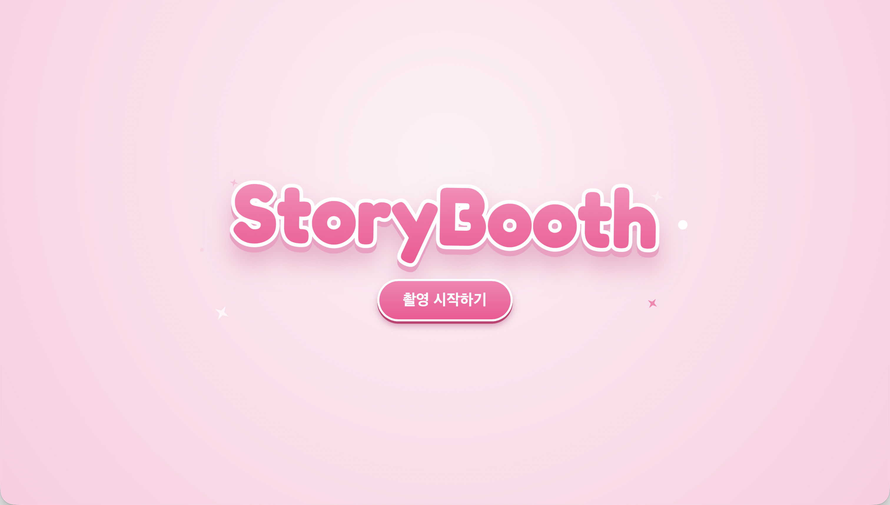
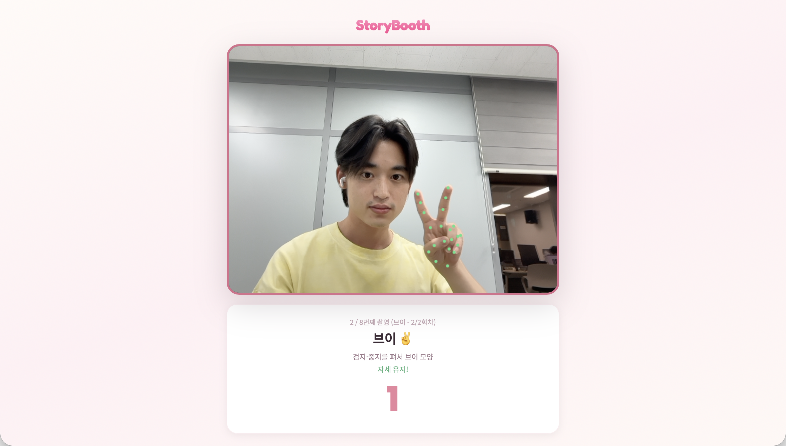
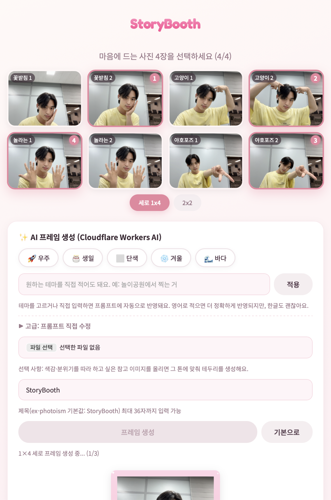
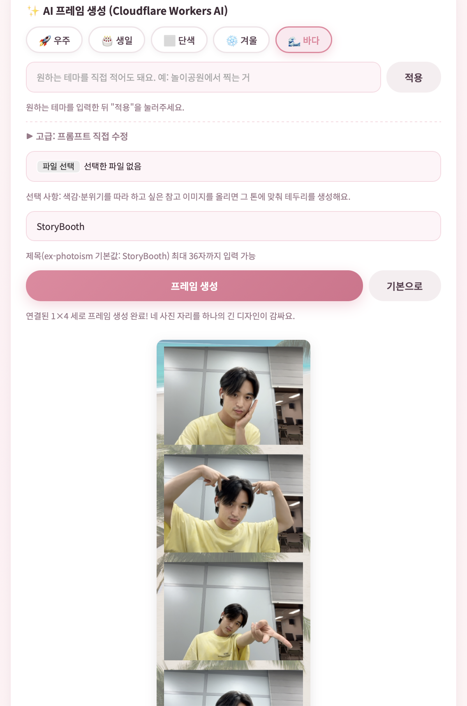
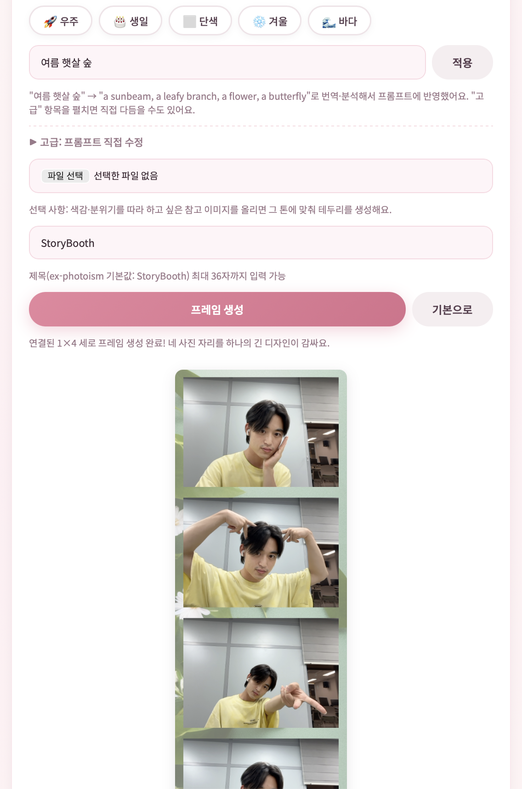
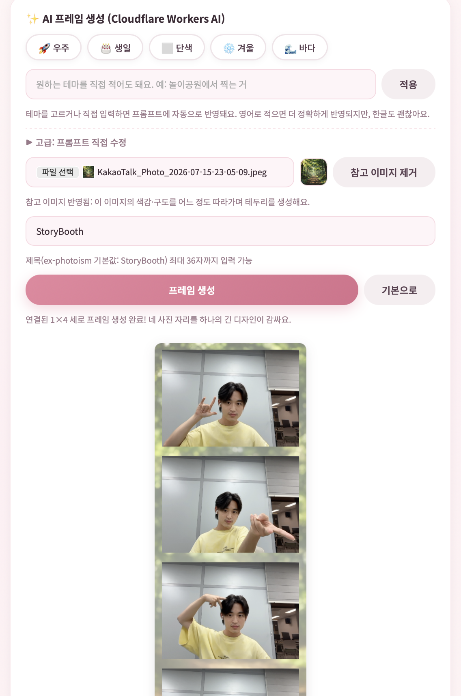
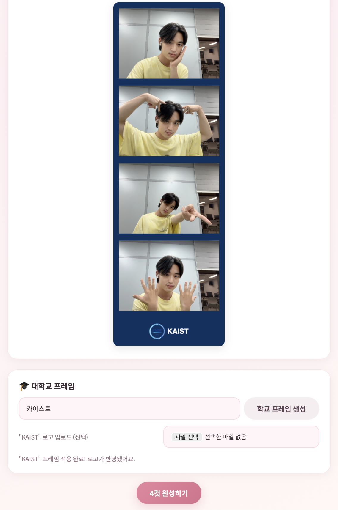
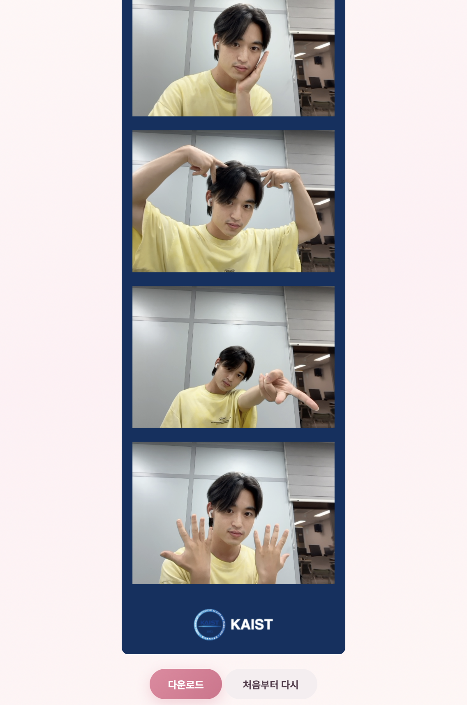

# 26s-w2-c3-04

## 공통과제 II : 협업형 실전 산출물 제작 (2인 1팀)

**목적:** 실시간 인터랙션, LLM Wrapper, Cross-Platform 중 하나의 옵션을 선택해 구현하며, 선택한 기술을 실제로 동작하는 형태의 산출물로 완성한다.

**선택 옵션:**

| 옵션 | 설명 |
|---|---|
| 실시간 인터랙션 | 사용자 간 상태 변화, 실시간 데이터 흐름, 스트리밍 응답 등 실시간성이 드러나는 기능을 구현 |
| LLM Wrapper | LLM API를 활용하여 AI 기능이 포함된 산출물을 구현 |
| Cross-Platform | 하나의 산출물을 여러 실행 환경에서 사용할 수 있도록 구현* |

> *데스크톱 앱 ↔ 모바일 앱; 혹은 다른 폼팩터에서의 앱; 웹만/웹 기반 프레임워크(Electron, Tauri 등) 대신 다른 프레임워크를 시도해보는 것을 적극 권장

**결과물:** 선택한 옵션이 적용된 작동 가능한 산출물, 실행 가능한 코드, 시연 자료 및 관련 문서

---

## 팀원

| 이름 | 학교 | GitHub | 역할 |
|---|---|---|---|
| 정유진 | 고려대 | yujin923 | 손동작 인식 파트 구현, 프레임 생성 파트 개선, UI, 배포 |
| 양호성 | 카이스트 | hoseong02 | 프레임 생성 파트 구현, 손동작 인식 파트 개선, 백엔드 |

---

## 선택 옵션

- [ ] 실시간 인터랙션
- [x] LLM Wrapper
- [ ] Cross-Platform

---

## 기획안

- **산출물 주제:** AI 인생네컷 — 자동으로 포즈를 제안 후 손동작을 인식해 자동 촬영, 원하는 테마에 맞는 프레임을 자동 생성해주는 웹 기반 네컷 사진 서비스
- **제작 목적:** 네컷 사진은 찍고 싶은데 포즈랑 프레임 정하는 게 귀찮은 사람들을 위해!
- **선택 옵션:** LLM Wrapper
- **핵심 구현 요소:**
  - MediaPipe HandLandmarker 기반 손동작 인식 — 지정 포즈(브이, 하트, 꽃받침 등 11종)를 취하면 자동으로 카운트다운·촬영
  - Cloudflare Workers AI 연동 — 자유 텍스트 테마를 LLM으로 영어 모티프 키워드로 변환하고, 인페인팅 모델로 네컷 프레임 이미지를 생성
- **사용 / 시연 시나리오:**
  1. 웹 페이지 접속 후 카메라 권한 허용
  2. 화면에 안내된 포즈를 취하면 인식 → 카운트다운 → 자동 촬영 (반복 촬영)
  3. 찍힌 사진 중 마음에 드는 4장 선택
  4. 원하는 프레임 테마 선택 or  원하는 스타일 자유 텍스트로 입력 (예: "숲속에서 찍은 느낌") or 대학교 프레임 선택 → AI가 프레임 생성
  5. 4컷 합성 결과 확인 후 이미지 다운로드
- **팀원별 역할:**
  - 정유진: 손동작 인식 프로토타입 구현, 프론트·백엔드 통합, AWS App Runner 배포
  - 양호성: AI 네컷 프로토타입·프레임 생성(Cloudflare Workers AI) 연동, Express 백엔드 구현, 손동작 인식 개선

### 개발 일정

| 날짜 | 목표 |
|---|---|
| Day 1 | 아이디어 선정 |
| Day 2 | 아이디어 구체화 및 손동작 인식 프로토타입 + AI 네컷 프로토타입 제작 |
| Day 3 | 손동작 종류 확정, 프레임 생성 프롬프트 베이스라인 작성 |
| Day 4 | 손동작 인식 개선, AI 프레임 생성(인페인팅) 프롬프트·품질 개선 |
| Day 5 | 손동작 인식 / 프레임 생성 통합, Express 백엔드 구현, 손동작 인식 개선 |
| Day 6 | AWS App Runner 배포, UI 개선, 프레임 생성 프롬프트 개선, 손동작 인식 개선 완료|
| Day 7 | 최종 완성 |

---

## 구현 명세서

| 구현 요소 | 설명 |
|---|---|
| 손동작 인식 자동 촬영 | MediaPipe HandLandmarker로 손 랜드마크를 추적하고, 포즈 판정 시 카운트다운 후 자동 촬영 |
| 테마 프리셋 선택 | 우주·생일·하트·단색·겨울·바다 등 프리셋 버튼으로 프레임 테마 선택 |
| 자유 테마 키워드 변환 | 사용자가 입력한 한국어 자유 테마를 LLM이 영어 모티프 키워드로 변환 |
| 스타일 참고 이미지 반영 | 원하는 색감·분위기의 이미지를 업로드하면 그 톤과 구도를 반영해 프레임 생성 |
| 대학교 로고 프레임 | 학교 이름을 입력하면 학교 고유 색상 + 로고를 프레임 하단에 자동으로 넣어 생성 |
| AI 프레임 생성 | Cloudflare Workers AI 인페인팅 모델로 테마에 맞는 네컷 프레임 이미지 생성 |
| 4컷 합성·다운로드 | 촬영 사진 4장을 생성된 프레임과 캔버스에서 합성해 다운로드 |
| AWS 배포 | Express 백엔드를 AWS App Runner에 배포, Cloudflare 인증값은 Secrets Manager로 관리 |


---

## 아키텍처

```text
브라우저 (public_index.html)
  ├─ MediaPipe HandLandmarker 손동작 인식
  ├─ 웹캠 촬영 · 사진 선택
  ├─ 프레임 베이스 이미지 · 마스크 생성
  ├─ POST /api/theme-keywords   (자유 테마 → 영어 키워드)
  └─ POST /api/generate-frame   (프레임 이미지 생성 요청)
             ↓
AWS App Runner (server.js, Express)
  ├─ 정적 페이지 제공
  ├─ 요청 검증 · 타임아웃 · 오류 처리
  └─ 서버에 보관한 Cloudflare 인증값으로 외부 API 호출
             ↓
Cloudflare Workers AI
  ├─ LLM: 자유 테마를 영어 모티프 키워드로 변환
  └─ 인페인팅 모델: 네컷 프레임 이미지 생성
```

사진, 동작 인식 결과, 생성 이미지는 서버에 저장하지 않으며(무상태 백엔드), 최종 합성과 다운로드는 모두 브라우저에서 수행합니다. 자세한 변경 경계는 [test/ARCHITECTURE.md](test/ARCHITECTURE.md) 참고.

---

## 설계 문서

> 프로젝트 성격에 따라 필요한 항목만 작성

### 화면 / 인터페이스 설계

#### 1. 오프닝 화면

<p align="center">
  
</p>

#### 2. 사진 촬영

제안된 포즈를 따라하면, 손동작을 인식해 자동으로 촬영합니다.

<p align="center">
  
</p>

#### 3. 사진 고르기

촬영된 8개의 사진 중 맘에 드는 사진을 선택합니다.

<p align="center">
  
</p>

#### 4. 프레임 생성(테마 프리셋)

5개의 테마 프리셋 중 하나를 선택해 프레임을 생성합니다.

<p align="center">
  
</p>

#### 5. 프레임 생성(자유 테마 키워드 변환)

직접 입력한 프롬프트에 따라 프레임을 생성합니다.

<p align="center">
  
</p>

#### 6. 프레임 생성(스타일 참고 이미지 반영)

참고 이미지를 입력해 프레임을 생성합니다.

<p align="center">
  
</p>

#### 7. 프레임 생성(대학교 로고 프레임)

대학교 이름을 입력해 자동으로 프레임을 생성합니다.

<p align="center">
  
</p>

#### 8. 완성

생성한 프레임으로 최종 완성된 네컷 사진을 확보합니다.

<p align="center">
  
</p>

### 데이터 구조

- DB 없음, 서버 파일 저장 없음
- 사진·마스크는 Base64 PNG로 브라우저 ↔ 서버 간 JSON으로만 전달 (요청 최대 25MB)
- Cloudflare 인증값은 서버 환경변수(`CLOUDFLARE_ACCOUNT_ID`, `CLOUDFLARE_API_TOKEN`)로만 관리하며 클라이언트에 노출되지 않음

### API / 외부 서비스 연동

| Method / 방식 | Endpoint / 서비스 | 설명 | 요청 | 응답 | 비고 |
|---|---|---|---|---|---|
| POST | `/api/theme-keywords` | 자유 테마를 영어 모티프 키워드로 변환 | `{ "text": "숲속에서 찍은 느낌" }` | `{ "keywords": "a small pine tree, ..." }` | 내부에서 Cloudflare LLM 호출 |
| POST | `/api/generate-frame` | 인페인팅으로 네컷 프레임 이미지 생성 | `prompt, negativePrompt, width, height, image, mask, seed, strength, guidance` | `{ "image": "Base64", "mime": "image/png" }` | 타임아웃 100초, 본문 최대 25MB |
| GET | `/health` | 서버 상태 확인 (AWS App Runner 헬스 체크) | - | `{ "status": "ok" }` | - |
| 외부 API | Cloudflare Workers AI | LLM 키워드 변환 + 인페인팅 이미지 생성 | 서버에서만 호출 | - | 토큰은 서버 측 보관 |

---

## 실행 방법

배포된 서비스에 바로 접속하거나, 로컬에서 직접 실행할 수 있습니다.

#### 방법 1. 배포된 링크로 접속 (권장)

별도 설치 없이 아래 링크에 접속하면 바로 사용할 수 있습니다.

> 🔗 **배포 링크:** _(배포 후 업데이트 예정)_

웹캠 사용을 위해 카메라 권한을 허용해 주세요.

#### 방법 2. 로컬에서 실행

```bash
cd test

# 환경 설정 (.env에 Cloudflare 계정 ID / API 토큰 입력)
cp .env.example .env

# 의존성 설치
npm install

# 실행
npm start
```

브라우저에서 `http://localhost:8787/` 접속. (HTML 파일을 더블클릭해 `file://`로 열면 API 연결이 안 됩니다.)

### 기술 구성

| 분류 | 사용 기술 |
|---|---|
| 핵심 기술 | MediaPipe Tasks Vision (HandLandmarker), Canvas API, Vanilla JS |
| 실행 환경 | 브라우저(프론트) + Node.js 22 / Express (백엔드), AWS App Runner 배포 |
| 데이터 저장 | 없음 (무상태 — DB·서버 파일 저장 미사용) |
| 외부 API / 서비스 | Cloudflare Workers AI (LLM 키워드 변환, 인페인팅 이미지 생성) |
| 기타 | AWS Secrets Manager (Cloudflare 인증값 보관), dotenv |

---

## 회고 문서

> [KPT 방법론 참고](https://velog.io/@habwa/%EB%8B%A8%EA%B8%B0-%ED%94%84%EB%A1%9C%EC%A0%9D%ED%8A%B8-%ED%9A%8C%EA%B3%A0-KPT-%EB%B0%A9%EB%B2%95%EB%A1%A0)

### Keep — 잘 된 점, 다음에도 유지할 것

- 동작 인식을 웹 상에서도 무리 없이 구현할 수 있음을 확인했다.
- 처음에는 정말 난해한 프레임 디자인이 나왔는데, 프롬프트를 개선해서 네컷 프레임에 어울리는 결과물을 도출할 수 있었다.
- 여러 손동작을 AI에게 프롬프트로 전달해 성공적으로 이해시켰다.

### Problem — 아쉬웠던 점, 개선이 필요한 것

- AI 프롬프트 작성으로 충분한 미감의 결과물을 뽑기에는 무리가 있었던 것 같다.
- 무료 모델을 사용할 수 밖에 없었다는 점이 아쉽다
- 동작 인식에 개인차가 존재하는 것 같아, 완벽하게 구현하지는 못했다.

### Try — 다음번에 시도해볼 것

- 유료 생성형 모델을 사용하면 더욱 훌륭한 미감의 결과물을 만들 수 있을 것 같다.
- Cross Platform까지 구현하여 모바일에서도 구동 가능하게 개선
- 동시에 여러 명이 원격으로 같이 사진을 찍는 기능 구현

### 팀원별 소감

**정유진:**

> 

**양호성:**

- 이번에도 미감에 관련된 주제를 원했다. 프롬프트 수정을 통해 프레임을 점점 개선하는 과정이 흥미로웠다.
- 무료 모델을 사용해서 그런 건지는 모르겠지만, 프롬프트 수정으로 프레임 미감을 개선하는데 한계가 있음을 느껴 아쉬웠다
- 몰입캠프 덕분에 다양한 시도를 해보는 것 같다

---

## 참고 자료

### 실시간 인터랙션

**WebSocket**
- https://developer.mozilla.org/en-US/docs/Web/API/WebSockets_API
- https://techblog.woowahan.com/5268/
- https://tech.kakao.com/posts/391
- https://daleseo.com/websocket/
- https://kakaoentertainment-tech.tistory.com/110

**Socket.IO**
- https://socket.io/docs/v4/
- https://inpa.tistory.com/entry/SOCKET-%F0%9F%93%9A-Namespace-Room-%EA%B8%B0%EB%8A%A5
- https://adjh54.tistory.com/549
- https://fred16157.github.io/node.js/nodejs-socketio-communication-room-and-namespace/

**SSE (Server-Sent Events)**
- https://developer.mozilla.org/en-US/docs/Web/API/Server-sent_events
- https://developer.mozilla.org/ko/docs/Web/API/Server-sent_events/Using_server-sent_events
- https://api7.ai/ko/blog/what-is-sse

**TCP / UDP Socket**
- https://docs.python.org/3/library/socket.html
- https://inpa.tistory.com/entry/NW-%F0%9F%8C%90-%EC%95%84%EC%A7%81%EB%8F%84-%EB%AA%A8%ED%98%B8%ED%95%9C-TCP-UDP-%EA%B0%9C%EB%85%90-%E2%9D%93-%EC%89%BD%EA%B2%8C-%EC%9D%B4%ED%95%B4%ED%95%98%EC%9E%90

**gRPC Streaming**
- https://grpc.io/docs/what-is-grpc/core-concepts/
- https://tech.ktcloud.com/entry/gRPC%EC%9D%98-%EB%82%B4%EB%B6%80-%EA%B5%AC%EC%A1%B0-%ED%8C%8C%ED%97%A4%EC%B9%98%EA%B8%B0-HTTP2-Protobuf-%EA%B7%B8%EB%A6%AC%EA%B3%A0-%EC%8A%A4%ED%8A%B8%EB%A6%AC%EB%B0%8D
- https://tech.ktcloud.com/entry/gRPC%EC%9D%98-%EB%82%B4%EB%B6%80-%EA%B5%AC%EC%A1%B0-%ED%8C%8C%ED%97%A4%EC%B9%98%EA%B8%B02-Channel-Stub
- https://inspirit941.tistory.com/371
- https://devocean.sk.com/blog/techBoardDetail.do?ID=167433

**WebRTC**
- https://developer.mozilla.org/en-US/docs/Web/API/WebRTC_API
- https://webrtc.org/getting-started/overview
- https://web.dev/articles/webrtc-basics?hl=ko
- https://devocean.sk.com/blog/techBoardDetail.do?ID=164885
- https://beomkey-nkb.github.io/%EA%B0%9C%EB%85%90%EC%A0%95%EB%A6%AC/webRTC%EC%A0%95%EB%A6%AC/
- https://gh402.tistory.com/45
- https://on.com2us.com/tech/webrtc-coturn-turn-stun-server-setup-guide/

**QUIC / WebTransport**
- https://developer.mozilla.org/en-US/docs/Web/API/WebTransport_API
- https://datatracker.ietf.org/doc/html/rfc9000
- https://news.hada.io/topic?id=13888

#### KCLOUD VM / Cloudflare Tunnel 환경별 주의사항

| 환경 | 사용 가능(권장) 기술 | 포트/조건 | 주의할 기술 |
|---|---|---|---|
| **로컬 / 일반 VM** | HTTP/REST, WebSocket, Socket.IO, SSE, TCP Socket, gRPC Streaming, WebRTC, QUIC/WebTransport 등 대부분 가능 | 직접 포트 개방 가능. 예: 3000, 5000, 8000, 8080, 9000 등. 외부 공개 시 방화벽/보안그룹/공인 IP 설정 필요 | WebRTC는 STUN/TURN 필요 가능. QUIC/WebTransport는 HTTP/3 · UDP 지원 필요 |
| **KCLOUD VM (VPN 내부)** | HTTP/REST, WebSocket, Socket.IO, SSE, WebRTC 시그널링 | 접속 기기 VPN 필요. 기본 허용 포트: **22, 80, 443**. 개발 포트(3000, 8000, 8080 등)는 직접 접근 제한 가능 | TCP Socket은 포트 제한 있음. gRPC는 HTTP/2 설정 필요. WebRTC 미디어·UDP·QUIC/WebTransport 비권장 |
| **KCLOUD VM + Tunnel** | HTTP/REST, WebSocket, Socket.IO, SSE, WebRTC 시그널링 | VM의 `localhost:<port>`를 도메인에 연결. `localPort`는 **1024~65535**. 예: 3000, 8000, 8080 가능 | 순수 TCP Socket, UDP, WebRTC 미디어/DataChannel, QUIC/WebTransport 불가. gRPC 보장 어려움 |
| **외부 서비스 + 우리 도메인** | HTTP/REST, WebSocket, Socket.IO, SSE, WebRTC 시그널링 | Vercel/Netlify/Railway/Render/AWS/GCP 등에 배포 후 CNAME/A 레코드 연결. 보통 외부는 **443** 사용 | WebSocket/gRPC/TCP/UDP는 플랫폼 지원 여부 확인 필요. 서버리스 플랫폼은 장시간 연결 제한 가능 |
| **서버 없이 외부 SaaS 사용** | Supabase Realtime, Firebase, Pusher/Ably, LLM API Streaming | 직접 포트 관리 불필요. 각 서비스 SDK/API 사용 | 커스텀 TCP/UDP 서버 구현 불가. WebRTC는 STUN/TURN 필요할 수 있음 |

### LLM Wrapper

- https://github.com/teddylee777/openai-api-kr
- https://github.com/teddylee777/langchain-kr
- https://devocean.sk.com/blog/techBoardDetail.do?ID=167407
- https://mastra.ai/docs

### Cross-Platform

- https://flutter.dev/
- https://reactnative.dev/
- https://docs.expo.dev/
- https://kotlinlang.org/multiplatform/
